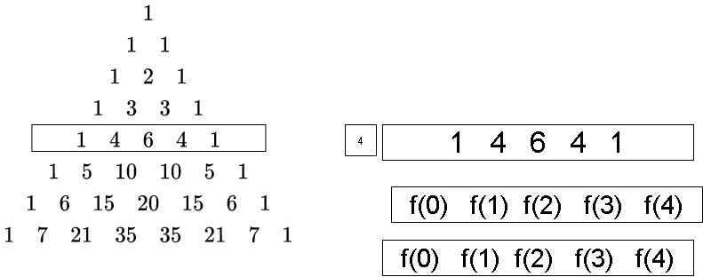

# heder

## sub section 

* item1
* item 2 

### todo 
* [ ] task1
* [x] task2 

```python
print("hello")
```

```
BEGIN { print 'hi' }
```

**bold** _italic_ `monospace`

[click here](https://google.com)

[solution](./pascal.py)